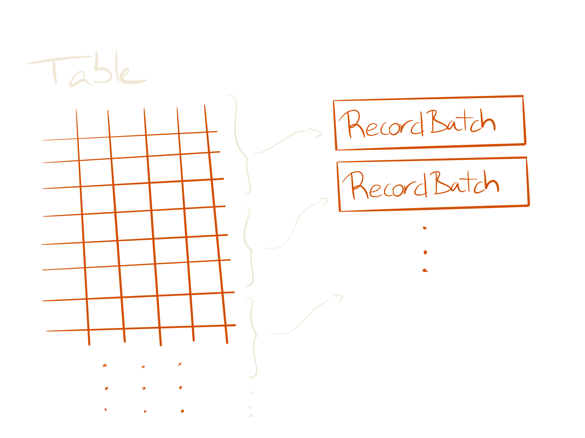

footer: ` 　　　　#UnifiedDataAnalytics #SparkAISummit`


^ Test footnote, hello

[.hide-footer]

---


[.hide-footer]

---

^ Test footnote 2, hello there

[.hide-footer]

---


# whoami

- Ruben Berenguel (@berenguel)
- PhD in Mathematics
- (big) data consultant
- Lead data engineer using **Python**, **Go** and **Scala**
- Right now at **Affectv**

^ I will start with what is `Pandas`, what is `Arrow` and how they relate. Then
explain a bit what is `Spark` and how it works (I'll try to be fast here) and
then how `PySpark` works. Finally, I'll cover why `Arrow` speeds up processes.

---

What is __Pandas__?

[.build-lists: true]

- Python __Data Analysis__ library
- Used __everywhere__ data and Python appear in __job offers__
- Efficient (is __columnar__ and has a __C__ and __Cython__ backend)

^ (third bullet: Have you ever asked yourself why "Columnar database" is so trendy?)

---


^ So, we have a table with many columns

---


^ And want the sum of one

---


^ Let's isolate it at the level of _one row_ and _one CPU_

---


^ Moving data from memory (or disk) to a cache line can be done in batches. If we have the data ordered by rows in memory or disk...

---


---


^ We move items one by one

---


---


^ Looks slow

---


^ If data is stored by column, we can load the whole column and operate straight
with it with less memory fetching

---


---

## How does __Pandas__ manage columnar data?

---


^ Imagine we have this table, with some columns of different types

---


^ Internally, `Pandas` handles columns _together by type_

---

[.footer: ]


^ So, we keep the index separate

---

[.footer: ]


^ All the floats "together"

---

[.footer: ]


^ Strings and binary stuff in the same place

---

[.footer: ]


^ And integers collected

---

[.footer: ]


^ A `BlockManager` structure handles these `Block`s

---

# What is __Arrow__?

[.build-lists: true]

- Cross-language in-memory __columnar format__ library
- Optimised for efficiency across languages
- Integrates seamlessly with __Pandas__

^ Some projects using Arrow internally are [Pandas](https://pandas.pydata.org/),
[Spark](https://spark.apache.org/contributing.html),
[Parquet](https://parquet.apache.org/), [Dask](https://github.com/dask/dask),
[Ray](https://github.com/ray-project/ray), a POC of data processing in Rust
with Arrow, [Ballista](https://github.com/andygrove/ballista), [PyJava](https://github.com/allwefantasy/pyjava) a Java/Scala connector for Python using Arrow to interchange data

---

## How does __Arrow__ manage columnar data?

^ I will show a simplification here

---


^ Everything starts with a `Table` structure

---



^ It is formed of `RecordBatches`, which contain a certain amount of rows. This
makes it a streamable format

---


^ So, we have rows

---


^ And together form a `RecordBatch`

---


^ Internally, `RecordBatches` have a columnar layout. Each `RecordBatch`
contains some additional metadata.

---


^ In the end, you can think of an Arrow `Table` is formed of a set of
`RecordBatches` for this presentation. It's actually a collection of _chunked
arrays_, where each array is formed of different chunked pieces column-wise.
RecordBatches have the same length (so, when you create a table from a set of
`RecordBatches` all the chunks are "the same"). Thanks Uwe L. Korn
([xhochy](https://github.com/xhochy)) for his pointer to this.

---


# 🏹 ❤️ 🐼

[.build-lists: true]

* __Arrow__ uses `RecordBatches` 
* __Pandas__ uses blocks handled by a `BlockManager`
* You can convert an __Arrow__ `Table` into a __Pandas__ `DataFrame` easily

^ Basically, from __Pandas__ to __Arrow__ you build `RecordBatches` out of data
consumed from a `BlockManager`, in reverse, you build a `BlockManager` with data
consumed from `RecordBatches`.

---


^ The internal layouts are similar enough that transforming one into the other
is close to being zero-copy. Since most of the code for this step is written in
`C` and `Cython`, it is _very_ fast. Note that Pandas is already storing data in a
columnar way: _Arrow just offers an unified way to be able to share the same data
representation among languages_. 
Thanks to [Marc Garcia](http://twitter.com/datapythonista) for pointing out this 
should be made more clear here

---

# What is __Spark__?

[.build-lists: true]

- Distributed Computation _framework_
- Open source
- Easy to use
- Scales horizontally *and* vertically

---

# How does __Spark work__?

---

[.footer: ]


# Spark usually runs on top of a __cluster manager__


^ This can be standalone, YARN, Mesos or in the bleeding edge, Kubernetes (using the Kubernetes scheduler)

---

[.footer: ]


# And a __distributed storage__

---

[.footer: ]


## A Spark program runs in the __driver__

---

[.footer: ]


## The __driver__ requests resources from the __cluster manager__ to run tasks

^ We usually don't need to worry about what the executors do (unless they blow up)

---

[.footer: ]


## The __driver__ requests resources from the __cluster manager__ to run tasks

---

[.footer: ]


## The __driver__ requests resources from the __cluster manager__ to run tasks

---

[.footer: ]


## The __driver__ requests resources from the __cluster manager__ to run tasks

^ This is very nice, but what is the magic that lets us compute things on
several machines, and is machine-failure safe?

---

## The main building block is the __RDD__: 

##__R__esilient __D__istributed __D__ataset

^ RDDs are defined in the Scala core. In Python and R we end up interacting with the underlying JVM objects

---

[.footer: ]


^ Happy RDD

---

[.footer: ]


^ Happy RDD. A RDD needs 5 items to be considered complete (2 of them optional)

---

[.footer: ]


^ Partitions define how the data is _partitioned_ across machines

---

[.footer: ]


---

[.footer: ]


^ Locations (`preferredLocations`) are optional, and allow for fine grained
execution to avoid shuffling data across the cluster

---

[.footer: ]


---

[.footer: ]


^ Compute is evaluated in the executors, each executor has access to its
assigned partitions. The result of compute is a new RDD, with different data

---

[.footer: ]


---

[.footer: ]


^ Dependencies are also called _lineage_. Each __RDD__ (and by extension, each
partition) has a specific way to be computed. If for some reason one is lost
(say, a machine dies), __Spark__ knows how to recompute _only_ that

---

[.footer: ]


---

[.footer: ]


^ The partitioner needs to be a 1-1 function from keys/whatever to the data, to
allow recomputing. It is as well optional (Spark will default to something
sensible then)

---

# Py__Spark__

^ I will use PySpark to refer to the Python API on top of Spark, and say Scala
Spark or just Spark for the Scala API

---

## __PySpark__ offers a _Python_ API to the _Scala_ core of __Spark__

---

# It uses the __Py4J__ bridge

^ Each object in PySpark comes bundled with a JVM gateway (started when the
Python driver starts). Python methods then act on the internal JVM object by
passing serialised messages to the Py4J gateway

---
```python
# Connect to the gateway
gateway = JavaGateway(
    gateway_parameters=GatewayParameters(
       port=gateway_port, 
       auth_token=gateway_secret,
       auto_convert=True))

# Import the classes used by PySpark
java_import(gateway.jvm, "org.apache.spark.SparkConf")
java_import(gateway.jvm, "org.apache.spark.api.java.*")
java_import(gateway.jvm, "org.apache.spark.api.python.*")
.
.
.
return gateway
```

---


^ Happy RDD in Python

---


---


^ Some `_jrdd` appears. Each "Spark" related object has some internal
relationship with an equivalent JVM object. An RDD, for instance, has a `_jrdd`,
which refers to how the RDD was created in the JVM. By extension, if in Python
you create an RDD from a file, for instance, this will call the JVM method to do
so, and the resulting Python object will have a `_jrdd` pointing to that.

---


^ Just like M is for Murder…

---


^ J is for Java. There are _a lot_ of properties prefixed with _j_ in classes in
PySpark, to denote they refer to a JVM object/property/class

---


---


---

## The main __entrypoints__ are `RDD` and `PipelinedRDD(RDD)`

^ In Python land. The first exposes the API of Scala RDDs (by interacting with
the JVM connected to the underlying RDD), the second defines how to apply a Python function
to an RDD. For instance, all map methods on RDDs defer to the
`mapPartitionsWithIndex` method, which builds a PipelinedRDD wrapping the Python
function to map, and then does some other things I'll explain later

---
[.footer: ]


## `PipelinedRDD` 
## builds in the __JVM__ a 
## `PythonRDD`

---


^ Angry RDD

---


^ With its `jrdd` (so, it's in Python land)

---


^ Let's map over this RDD

---


^ RDD's `map` will create a `PipelinedRDD`

---


^ Will put the function in the `func` field

---


^ And will point `prev` to the RDD. Missing anything?

---


^ And now, what is the `_jrdd` of the PipelinedRDD?

---


^ It's a `PythonRDD` (built via Py4J of course, this is in the Scala code), which is a sub-class of `RDD`

---


---


---


^ The dependencies of this RDD will point to the original `_jrdd`

---


---


^ The compute method will wrap the function defined in `func`

---

[.footer: ]


# The __magic__ is in 
# `compute`

^ of `PythonRDD` It's where something gets eventually done to the RDD _in_ Python

---

[.footer: ]


# `compute` 
## is run on each __executor__ and starts a Python __worker__ via `PythonRunner`

^ It will send all includes, broadcasts, etc through the stream. And actually
the order of the data sent is important

---

[.footer: ]


---

[.footer: ]


---

[.footer: ]


---

[.footer: ]


---

[.footer: ]


---

[.build-lists: true]

Workers act as __standalone processors__ of __streams of data__

* Connects back to the __JVM__ that started it
* Load included __Python__ libraries
* __Deserializes__ the pickled function coming from the stream
* Applies the __function__ to the data coming from the stream
* Sends the __output__ back

---

…

^ But, maybe you are missing something here, isn't Spark supposed to be pretty
magic and plan and optimise stuff?

---

## But… wasn't __Spark__ magically optimising everything?

---

# Yes, for __Spark__ `DataFrame`

^ You can think of `DataFrame`s as RDDs which actually refer to tables. They
have column names, and may have types for each column

---

[.footer: ]


## Spark will generate a __plan__
### (a __D__irected __A__cyclic __G__raph) 
## to compute the result

^ When you operate on DataFrames, plans are created magically. And actually it
will generate a logical plan, an optimised logical plan, an execution plan…

---

[.footer: ]


## And the plan will be optimised using __Catalyst__

^ The Catalyst optimiser. There's also a code generator in there (using Janino
to compile Java code in real time, how that works and why is a matter for
another presentation…) Catalyst prunes trees

---

### Depending on the function, the optimiser will choose
### `PythonUDFRunner`
### __or__ 
### `PythonArrowRunner`
#### (both extend `PythonRunner`)

^ For the physical execution node in the plan

---

[.footer: ]


---

[.footer: ]


^ In the stream information about environment, length of data, versions, etc
will be sent first. Then data will be serialized in batches (of 100 rows I
think) using a Pickle implementation in Java (net.razorvine.pickle.{Pickler,
Unpickler})

---

[.footer: ]


^ In Python land, after loading all the configuration and startup stuff, the
data is unpickled

---

[.footer: ]


^ The stream is loaded as an iterator, and the function is applied to each item
in the batch

---

[.footer: ]


^ Then the data is serialized back to send to the JVM

---

[.footer: ]


^ Arrow works a bit different, but not much

---

[.footer: ]


^ Data is sent as Arrow RecordBatch-es

---

[.footer: ]


^ Converting RecordBatches to a Pandas dataframe is essentially cost 0
(specially compared with pickling)

---

[.footer: ]


^ Applying a function to a column is super-fast, since it involves only running
through all elements of the column. And the data has been loaded columnar
already. There are other columnar solutions you can plug into Spark directly for
working only in Scala, but they also work as data stores as well (see [Apache
Kudu](https://github.com/apache/kudu) and partially, [Apache
Ignite](https://github.com/apache/ignite)). There is also ongoing work for
exposing to the user an API of columnar data in Spark in this
[SPIP](https://issues.apache.org/jira/browse/SPARK-27396). This would make
working with pure columnar data (for instance, Parquet) faster for advanced
users.

---

[.footer: ]


^ Data is sent back in Arrow columnar format, which again is pretty much
cost-free in the Python side

---

### If we can define our functions using Pandas `Series` transformations we can speed up __PySpark__ code from __3x__ to __100x__!

^ See here: https://databricks.com/blog/2017/10/30/introducing-vectorized-udfs-for-pyspark.html

---

# Quick examples

---

## The basics: `toPandas`
[.code-highlight: 3]
```python
from pyspark.sql.functions import rand

df = spark.range(1 << 20).toDF("id").withColumn("x", rand())

spark.conf.set("spark.sql.execution.arrow.enabled", "false")
pandas_df = df.toPandas() #  we'll time this
```

^ This comes directly from the speed comparisons by Bryan Cutler [here](https://bryancutler.github.io/toPandas/)

---

[.code-highlight: 3, 5, 6]
```python
from pyspark.sql.functions import rand

df = spark.range(1 << 20).toDF("id").withColumn("x", rand())

spark.conf.set("spark.sql.execution.arrow.enabled", "false")
pandas_df = df.toPandas() #  we'll time this
```

---

[.code-highlight: 3, 5, 6]
```python
from pyspark.sql.functions import rand

df = spark.range(1 << 20).toDF("id").withColumn("x", rand())

spark.conf.set("spark.sql.execution.arrow.enabled", "true")
pandas_df = df.toPandas() #  we'll time this
```

---

[.footer: ]


^ You can find the table at the end of the presentation. Direct conversion fails
for larger powers with either Py4j running out of memory or the driver running
out of heap with my local setup

---

[.footer: ]


---

## The fun: `.groupBy`

[.code-highlight: 4, 5]

```python
from pyspark.sql.functions import rand, randn, floor
from pyspark.sql.functions import pandas_udf, PandasUDFType

df = spark.range(20000000).toDF("row").drop("row") \
     .withColumn("id", floor(rand()*10000)).withColumn("spent", (randn()+3)*100)

@pandas_udf("id long, spent double", PandasUDFType.GROUPED_MAP)
def subtract_mean(pdf):
    spent = pdf.spent
    return pdf.assign(spent=spent - spent.mean())

df_to_pandas_arrow = df.groupby("id").apply(subtract_mean).toPandas()
```

^ We have a list of transactions and we want to see how they deviate from the mean for the corresponding user

---

[.code-highlight: 7-12]

```python
from pyspark.sql.functions import rand, randn, floor
from pyspark.sql.functions import pandas_udf, PandasUDFType

df = spark.range(20000000).toDF("row").drop("row") \
     .withColumn("id", floor(rand()*10000)).withColumn("spent", (randn()+3)*100)

@pandas_udf("id long, spent double", PandasUDFType.GROUPED_MAP)
def subtract_mean(pdf):
    spent = pdf.spent
    return pdf.assign(spent=spent - spent.mean())

df_to_pandas_arrow = df.groupby("id").apply(subtract_mean).toPandas()
```

^ It's straightforward with a `GROUPED_MAP` UDF. This takes around `180s` for `1<<25` records, `75s` for `20M` records

---

[.footer: ]


^ We have a dataset we want to perform some grouping operation

---

[.footer: ]


^ The dataset is shuffled as needed by the grouping columns

---

[.footer: ]


^ Note that each machine needs to have enough memory for the largest groups, but
the work is being done in each machine via the UDF defined in Python, and data
exchanged via Arrow

---

[.footer: ]


^ Finally only the required columns and data are passed to the driver, and we
collect there `.toPandas`

---

## Before you may have done something like..

```python
import numpy as np
from pyspark.sql.functions import collect_list

grouped = df2.groupby("id").agg(collect_list('spent').alias("spent_list"))
as_pandas = grouped.toPandas()
as_pandas["mean"] = as_pandas["spent_list"].apply(np.mean)
as_pandas["substracted"] = as_pandas["spent_list"].apply(np.array) - as_pandas["mean"]
df_to_pandas = as_pandas.drop(columns=["spent_list", "mean"]).explode("substracted")
```

^ Yikes

---

[.code-highlight: 5]

```python
import numpy as np
from pyspark.sql.functions import collect_list

grouped = df2.groupby("id").agg(collect_list('spent').alias("spent_list"))
as_pandas = grouped.toPandas()
as_pandas["mean"] = as_pandas["spent_list"].apply(np.mean)
as_pandas["substracted"] = as_pandas["spent_list"].apply(np.array) - as_pandas["mean"]
df_to_pandas = as_pandas.drop(columns=["spent_list", "mean"]).explode("substracted")
```

^ This is painful now: we are sending _all_ the grouped data to the driver. This
fails for `1 << 25` with the driver dying and around `180s` for `20M` records.
Note that there are other options that can do some or part of the work in the
executors but that would get tricky _very_ quick if you want to stay in Python
land.

---

[.footer: ]


^ As before, some data gets distributed/shuffled

---

[.footer: ]


^ The operation goes to the executors

---


[.footer: ]


^ They group and aggregate with the not-fancy `collect_list` (when this is too
large, fun times)

---


[.footer: ]


^ The `collect_list`-collected data is now sent to the driver, to finalise the
operation in Python

---


[.footer: ]


^ All this data is slowly serialized into a Pandas dataframe

---


[.footer: ]


^ _If_ this fits in memory in the driver, now the final work happens. That's a
_big if_.

---

[.footer: ` 　　　　#UnifiedDataAnalytics #SparkAISummit 🎗`]

## TLDR: 

### Use[^1] __Arrow__ and Pandas __UDF__s

[^1]: in pyspark

---

# __Resources__

* [Spark documentation](https://spark.apache.org/docs/latest/)
*  [High Performance Spark by Holden Karau](https://www.amazon.com/High-Performance-Spark-Practices-Optimizing/dp/1491943203/ref=sr_1_3?ie=UTF8&qid=1528135254&sr=8-3&keywords=holden+karau)
* [The Internals of Apache Spark 2.4.2 by Jacek Laskowski](https://jaceklaskowski.gitbooks.io/mastering-apache-spark/)
* [Spark's Github](https://github.com/apache/spark)
* [Become a contributor](https://spark.apache.org/contributing.html)

---

# Questions?

---


# __Thanks!__

---

[.footer: ]


Get the slides from my github:

`github.com/rberenguel/`

The repository is 

`pyspark-arrow-pandas`

---


[.hide-footer]

---

# Further references

---

[.autoscale: true]

## __Arrow__
[Arrow's __home__](https://arrow.apache.org)
[Arrow's __github__](https://github.com/apache/arrow)
[Arrow speed __benchmarks__](https://gist.github.com/wesm/0cb5531b1c2e346a0007)
[Arrow to Pandas conversion __benchmarks__](http://wesmckinney.com/blog/high-perf-arrow-to-pandas/)
[__Post__: Streaming columnar data with Apache Arrow](http://wesmckinney.com/blog/arrow-streaming-columnar/)
[__Post__: Why Pandas users should be excited by Apache Arrow](http://wesmckinney.com/blog/pandas-and-apache-arrow/)
[__Code__: Arrow-Pandas compatibility layer code](https://github.com/apache/arrow/blob/master/python/pyarrow/pandas_compat.py)
[__Code__: Arrow Table code](https://github.com/apache/arrow/blob/master/python/pyarrow/table.pxi)
[PyArrow in-memory __data model__](https://arrow.apache.org/docs/python/data.html)
[Ballista:  a __POC__ distributed compute platform (Rust)](https://github.com/andygrove/ballista)
[PyJava: __POC__ on Java/Scala and Python data interchange with Arrow](https://github.com/allwefantasy/pyjava)

---

[.autoscale: true]

## __Pandas__
[Pandas' __home__](http://pandas.pydata.org)
[Pandas' __github__](https://github.com/pandas-dev/pandas)
[__Guide__: Idiomatic Pandas](https://tomaugspurger.github.io/modern-1-intro.html)
[__Code__: Pandas internals](https://github.com/pandas-dev/pandas/blob/master/pandas/core/internals.py)
[__Design__: Pandas internals ](https://github.com/pydata/pandas-design/blob/master/source/internal-architecture.rst)
[__Talk__: Demystifying Pandas' internals, by Marc Garcia](https://www.youtube.com/watch?v=F37fV0uFf60)
[Memory Layout of Multidimensional Arrays in __numpy__](https://eli.thegreenplace.net/2015/memory-layout-of-multi-dimensional-arrays/)

---

[.autoscale: true]

## __Spark/PySpark__

[__Code__: PySpark serializers](https://github.com/apache/spark/blob/master/python/pyspark/serializers.py)
[__JIRA__: First steps to using Arrow (only in the PySpark driver)](https://issues.apache.org/jira/browse/SPARK-13534)
[__Post__: Speeding up PySpark with Apache Arrow](https://arrow.apache.org/blog/2017/07/26/spark-arrow/)
[Original __JIRA__ issue: Vectorized UDFs in Spark](https://issues.apache.org/jira/browse/SPARK-21190)
[Initial __doc__ draft](https://github.com/icexelloss/spark/blob/pandas-udf-doc/docs/pyspark-pandas-udf.md#definition-of-pandas-udf)
[__Post__ by Bryan Cutler (leader for the Vec UDFs PR)](https://bryancutler.github.io/vectorizedUDFs/)
[__Post__: Introducing Pandas UDF for PySpark](https://databricks.com/blog/2017/10/30/introducing-vectorized-udfs-for-pyspark.html)
[__Code__: org.apache.spark.sql.vectorized](https://github.com/apache/spark/tree/dd8e257d1ccf20f4383dd7f30d634010b176f0d3/sql/core/src/main/java/org/apache/spark/sql/vectorized)
[__Post__ by Bryan Cutler: Spark toPandas() with Arrow, a Detailed Look](https://bryancutler.github.io/toPandas/)

---

[.autoscale: true]

## __Py4J__

[Py4J's __home__](https://www.py4j.org)
[Py4J's __github__](https://github.com/bartdag/py4j)
[__Code__: Reflection engine](https://github.com/bartdag/py4j/blob/master/py4j-java/src/main/java/py4j/reflection/ReflectionEngine.java)

---

# Table for `toPandas`

 2^x   | Direct (s) | With Arrow (s) |  Factor 
---|---|---|---
 17 | 1,08   | 0,18       | 5,97 
 18 | 1,69   | 0,26       | 6,45 
 19 | 4,16   | 0,30       | 13,87
 20 | 5,76   | 0,61       | 9,44 
 21 | 9,73   | 0,96       | 10,14
 22 | 17,90  | 1,64       | 10,91
 23 | (OOM)    | 3,42       |      
 24 | (OOM)    | 11,40      |      

---

# `EOF`
