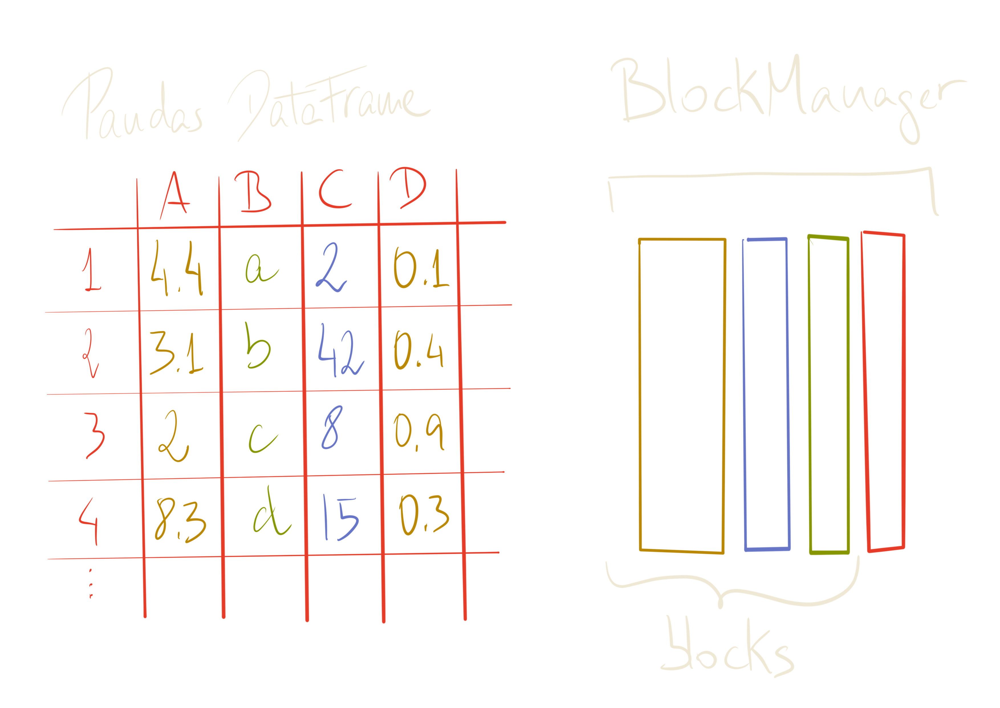

## Speeding up __PySpark__ with __Arrow__

---

---


# whoami

- Ruben Berenguel (@berenguel)
- PhD in Mathematics
- (big) data consultant
- Lead data engineer using **Python**, **Go** and **Scala**
- Right now at **Affectv**

---

What is __Pandas__?

[.build-lists: true]

- Python __Data Analysis__ library
- Used __everywhere__ data and Python appear in __job offers__
- Efficient (is __columnar__ and has a __C__ and __Cython__ backend)

---


^ Have you ever asked yourself why "Columnar database" is so trendy?

---


---


---


^ Moving data from memory to a cache line can be done in batches. If data is
stored by column, we can load the whole column and operate straight with it with
less memory fetching

---


---


---


---


---


---


---

## How does __Pandas__ manage columnar data?

---


---


---


---


---


---


---



---

# What is __Arrow__?

[.build-lists: true]

- Cross-language in-memory __columnar format__ library
- Optimised for efficiency across languages
- Integrates seamlessly with __Pandas__

---

## How does __Arrow__ manage columnar data?

---


^ Everything starts with a `Table` structure

---


^ It is formed of `RecordBatches`, which contain a certain amount of rows. This
makes it a streamable format

---


---


---


^ Internally, `RecordBatches` have a columnar layout. Each `RecordBatch`
contains some additional metadata.

---


^ In the end, an Arrow `Table` is formed of a set of `RecordBatches`

---


# 🏹 ❤️ 🐼

[.build-lists: true]

* __Arrow__ uses `RecordBatches` 
* __Pandas__ uses blocks handled by a `BlockManager`
* You can convert an __Arrow__ `Table` into a __Pandas__ `DataFrame` easily

^ Basically, from __Pandas__ to __Arrow__ you build `RecordBatches` out of data
consumed from a `BlockManager`, in reverse, you build a `BlockManager` with data
consumed from `RecordBatches`.

---


^ The internal layouts are similar enough that transforming one into the other
is close to being zero-copy. Since most of the code for this step is written in
`C` and `Cython`, it is _very_ fast. Note that Pandas is already storing data in a
columnar way: _Arrow just offers an unified way to be able to share the same data
representation among languages_. 
Thanks to [Marc Garcia](http://twitter.com/datapythonista) for pointing out this 
should be made more clear here

---

# What is __Spark__?

[.build-lists: true]

- Distributed Computation _framework_
- Open source
- Easy to use
- Scales horizontally *and* vertically

---

# How does __Spark work__?

---


# Spark usually sits on top of a __cluster manager__


^ This can be standalone, YARN, Mesos or in the bleeding edge, Kubernetes (using the Kubernetes scheduler)

---


# And a __distributed storage__

---


## A Spark program runs in the __driver__

---


## The __driver__ requests resources from the __cluster manager__ to run tasks

^ We usually don't need to worry about what the executors do (unless they blow up)

---


## The __driver__ requests resources from the __cluster manager__ to run tasks

---


## The __driver__ requests resources from the __cluster manager__ to run tasks

---


## The __driver__ requests resources from the __cluster manager__ to run tasks

^ This is very nice, but what is the magic that lets us compute things on
several machines, and is machine-failure safe?

---

## The main building block is the __RDD__: 

##__R__esilient __D__istributed __D__ataset

^ RDDs are defined in the Scala core. In Python and R we end up interacting with the underlying JVM objects

---


^ Happy RDD

---


^ Happy RDD

---


^ Partitions define how the data is _partitioned_ across machines

---


^ Locations (`preferredLocations`) are optional, and allow for fine grained
execution to avoid shuffling data across the cluster

---


---


---


^ Compute is evaluated in the executors, each executor has access to its
assigned partitions. The result of compute is a new RDD, with different data

---


---


^ Dependencies are also called _lineage_. Each __RDD__ (and by extension, each
partition) has a specific way to be computed. If for some reason one is lost
(say, a machine dies), __Spark__ knows how to recompute _only_ that

---


---


^ The partitioner needs to be a 1-1 function from keys/whatever to the data, to
allow recomputing

---

# Py__Spark__

---

## __PySpark__ offers a _Python_ API to the _Scala_ core of __Spark__

---

# It uses the __Py4J__ bridge

^ Each object in PySpark comes bundled with a JVM gateway (started when the
Python driver starts). Python methods then act on the internal JVM object by
passing serialised messages to the Py4J gateway

---
```python
# Connect to the gateway
gateway = JavaGateway(
    gateway_parameters=GatewayParameters(
       port=gateway_port, 
       auth_token=gateway_secret,
       auto_convert=True))

# Import the classes used by PySpark
java_import(gateway.jvm, "org.apache.spark.SparkConf")
java_import(gateway.jvm, "org.apache.spark.api.java.*")
java_import(gateway.jvm, "org.apache.spark.api.python.*")
.
.
.
return gateway
```

---


^ Happy RDD in Python

---


---


^ Some `_jrdd` appears. Each "Spark" related object has some internal
relationship with an equivalent JVM object. An RDD, for instance, has a `_jrdd`,
which refers to how the RDD was created in the JVM. By extension, if in Python
you create an RDD from a file, for instance, this will call the JVM method to do
so, and the resulting Python object will have a `_jrdd` pointing to that.

---


^ Just like M is for Murder...

---


^ J is for Java. There are _a lot_ of properties prefixed with _j_ in PySpark,
to denote they refer to a JVM object/property/class

---


---


---

## The main __entrypoints__ are `RDD` and `PipelinedRDD(RDD)`

^ In Python land. The first exposes the API of Scala RDDs (by interacting with
the JVM connected to the RDD), the second defines how to apply a Python function
to an RDD. For instance, all map methods on RDDs defer to the
`mapPartitionsWithIndex` method, which builds a PipelinedRDD wrapping the Python
function to map, and then does some other things I'll explain later

---


## `PipelinedRDD` 
## builds in the __JVM__ a 
## `PythonRDD`

---


^ Angry RDD

---


^ With its `jrdd` (so, it's in Python land)

---


^ Let's map over this RDD!

---


^ RDD's `map` will create a `PipelinedRDD`

---


^ Will put the function in the `func` field

---


^ And will point `prev` to the RDD. Missing anything?

---


^ And now, what is the `_jrdd` of the PipelinedRDD?

---


^ It's a `PythonRDD` (built via Py4J of course, this is in the Scala code), which is a sub-class of `RDD`

---


---


---


^ The dependencies of this RDD will point to the original `_jrdd`

---


---


^ The compute method will wrap the function defined in `func`

---


# The __magic__ is in 
# `compute`

^ of `PythonRDD` It's where something gets eventually done to the RDD _in_ Python

---


# `compute` 
## is run on each __executor__ and starts a Python __worker__ via `PythonRunner`

^ It will send all includes, broadcasts, etc through the stream. And actually
the order of the data sent is important

---


---


---


---


---


---

[.build-lists: true]

Workers act as __standalone processors__ of __streams of data__

* Connects back to the __JVM__ that started it
* Load included __Python__ libraries
* __Deserializes__ the pickled function coming from the stream
* Applies the __function__ to the data coming from the stream
* Sends the __output__ back

---

...

^ But, maybe you are missing something here, isn't Spark supposed to be pretty
magic and plan and optimise stuff?

---

## But... wasn't __Spark__ magically optimising everything?

---

# Yes, for __Spark__ `DataFrame`

^ You can think of `DataFrame`s as RDDs which actually refer to tables. They
have column names, and may have types for each column

---


## Spark will generate a __plan__
### (a __D__irected __A__cyclic __G__raph) 
## to compute the result

^ When you operate on DataFrames, plans are created magically. And actually it
will generate a logical plan, an optimised logical plan, an execution plan...

---


## And the plan will be optimised using __Catalyst__

^ The Catalyst optimiser. There's also a code generator in there (using Janino
to compile Java code in real time) It prunes trees

---

### Depending on the function, the optimiser will choose
### `PythonUDFRunner`
### __or__ 
### `PythonArrowRunner`
#### (both extend `PythonRunner`)

---


---


^ In the stream information about environment, length of data, versions, etc
will be sent first. Then data will be serialized in batches (of 100 rows I
think) using a Pickle implementation in Java (net.razorvine.pickle.{Pickler,
Unpickler})

---


^ In Python land, after loading all the configuration and startup stuff, the
data is unpickled

---


^ The stream is loaded as an iterator, and the function is applied to each item
in the batch

---


^ Then the data is serialized back to send to the JVM

---


^ Arrow works a bit different, but not much

---


^ Data is sent as Arrow RecordBatch-es

---


^ Converting RecordBatches to a Pandas dataframe is essentially cost 0
(specially compared with pickling)

---


^ Applying a function to a column is super-fast, since it involves only running
through all elements of the column. And the data has been loaded columnar
already!

---


^ Data is sent back in Arrow columnar format, which again is pretty much
cost-free in the Python side

---

### If we can define our functions using Pandas `Series` transformations we can speed up __PySpark__ code from __3x__ to __100x__!

^ See here: https://databricks.com/blog/2017/10/30/introducing-vectorized-udfs-for-pyspark.html

---

# __Resources__

* [Spark documentation](https://spark.apache.org/docs/latest/)
*  [High Performance Spark by Holden Karau](https://www.amazon.com/High-Performance-Spark-Practices-Optimizing/dp/1491943203/ref=sr_1_3?ie=UTF8&qid=1528135254&sr=8-3&keywords=holden+karau)
* [Mastering Apache Spark 2.3 by Jacek Laskowski](https://jaceklaskowski.gitbooks.io/mastering-apache-spark/)
* [Spark's Github](https://github.com/apache/spark)
* [Become a contributor](https://spark.apache.org/contributing.html)

---

# Questions?

---


# __Thanks!__

---

# Further references

---

## __Arrow__
[Arrow's home](https://arrow.apache.org)
[Arrow's github](https://github.com/apache/arrow)
[Arrow speed tests](https://gist.github.com/wesm/0cb5531b1c2e346a0007)
[Arrow to Pandas conversion speed](http://wesmckinney.com/blog/high-perf-arrow-to-pandas/)
[Streaming columnar data with Apache Arrow](http://wesmckinney.com/blog/arrow-streaming-columnar/)
[Why Pandas users should be excited by Apache Arrow](http://wesmckinney.com/blog/pandas-and-apache-arrow/)
[Arrow-Pandas compatibility layer code](https://github.com/apache/arrow/blob/master/python/pyarrow/pandas_compat.py)
[Arrow Table code](https://github.com/apache/arrow/blob/master/python/pyarrow/table.pxi)
[PyArrow in-memory data model](https://arrow.apache.org/docs/python/data.html)

---

## __Pandas__
[Pandas' home](http://pandas.pydata.org)
[Pandas' github](https://github.com/pandas-dev/pandas)
[Idiomatic Pandas guide](https://tomaugspurger.github.io/modern-1-intro.html)
[Pandas internals code](https://github.com/pandas-dev/pandas/blob/master/pandas/core/internals.py)
[Pandas internals design](https://github.com/pydata/pandas-design/blob/master/source/internal-architecture.rst)
[Demystifying Pandas' internals (talk by Marc Garcia)](https://www.youtube.com/watch?v=F37fV0uFf60)
[Memory Layout of Multidimenstional Arrays (Numpy)](https://eli.thegreenplace.net/2015/memory-layout-of-multi-dimensional-arrays/)

---

## __Spark/PySpark__

[PySpark serializers code](https://github.com/apache/spark/blob/master/python/pyspark/serializers.py)
[First steps to using Arrow (only in the PySpark driver)](https://issues.apache.org/jira/browse/SPARK-13534)
[Speeding up PySpark with Apache Arrow](https://arrow.apache.org/blog/2017/07/26/spark-arrow/)
[Original JIRA issue: Vectorized UDFs in Spark](https://issues.apache.org/jira/browse/SPARK-21190)
[Initial doc draft](https://github.com/icexelloss/spark/blob/pandas-udf-doc/docs/pyspark-pandas-udf.md#definition-of-pandas-udf)
[Blog post by Bryan Cutler (leader for the Vec UDFs PR)](https://bryancutler.github.io/vectorizedUDFs/)
[Introducing Pandas UDF for PySpark](https://databricks.com/blog/2017/10/30/introducing-vectorized-udfs-for-pyspark.html)
[org.apache.spark.sql.vectorized](https://github.com/apache/spark/tree/dd8e257d1ccf20f4383dd7f30d634010b176f0d3/sql/core/src/main/java/org/apache/spark/sql/vectorized)

---

## __Py4J__

[Py4J's home](https://www.py4j.org)
[Py4J's github](https://github.com/bartdag/py4j)
[Reflection engine](https://github.com/bartdag/py4j/blob/master/py4j-java/src/main/java/py4j/reflection/ReflectionEngine.java)

---

# `EOF`
